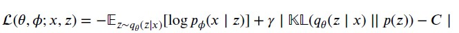

# Disentangling the latent space of Variational Autoencoder
Disentangling the latent space learned by a VAE has been subject to a lot of research in recent years.
This repository provides a simple tensorflow implementation of a Variational Autoencoder and the objective function proposed by [1]:

Experiments showed that this modification to the objective function improves the tradeoff
between reconstruction quality and disentanglement

## Usage
1. Run `pip install -r requirements.txt`
2. Either run `python visualize.py` to visualize an existing model or `python train.py` to train a new model.
3. The Dsprites dataset used in the repository can be found [here](https://github.com/deepmind/dsprites-dataset/blob/master/dsprites_ndarray_co1sh3sc6or40x32y32_64x64.npz):

[1] BURGESS, C. P., HIGGINS, I., PAL, A., MATTHEY, L., WATTERS, N., DESJARDINS, G., AND LERCHNER, A. Understanding disentangling in β-VAE. ArXiv abs/1804.03599 (2018).